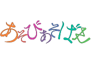
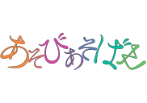
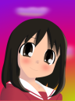
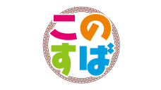

Collection of various vector art I've made. Some were done for practical purposes like printing on t-shirts, some for aesthetic purposes, some for fun.

Every image is available under CC BY-NC-SA 4.0 and released in source form (an SVG file) as well as various resolutions of raster form (a PNG file). Select one you want and download it.

Note that some images deliberately have a transparent background, so you can use them on any background color you want. This is especially useful for printing on t-shirts.

Hosted via GitHub Pages at [https://worldemar.github.io/svg/](https://worldemar.github.io/svg/)

---

| Preview | Description and links |
| :-: | :- |
|  | Title from [Asobi Asobase](https://en.wikipedia.org/wiki/Asobi_Asobase). Traced and manually modified from high-resolution frame. Calligraphy was relatively hard to replicate with bezier curves, but I managed to get it close to original. I intentionally omitted "ASOBI ASOBASE" romanization as it is too small for printing anyway. Colors may be imperceptibly inaccurate.  [128](asobi-asobase-title/asobi-asobase-title_128.png) - [480](asobi-asobase-title/asobi-asobase-title_480.png) - [720](asobi-asobase-title/asobi-asobase-title_720.png) - [1080](asobi-asobase-title/asobi-asobase-title_1080.png) - [1440](asobi-asobase-title/asobi-asobase-title_1440.png) - [2160](asobi-asobase-title/asobi-asobase-title_2160.png) - [**SVG**](asobi-asobase-title/asobi-asobase-title.svg) |
|  | Title from [Asobi Asobase](https://en.wikipedia.org/wiki/Asobi_Asobase). Traced and manually modified from high-resolution frame. This one has added 0.5 mm outlines for contrast. Normally it would not make sense to have outlined image as separate file. In this case calligraphy has intersections that messes up outlines. So for outlines to work I had to merge curves into one shape, making this version essentially uneditable. You can modify outline thickness or color if you like, but that is about it.  [128](asobi-asobase-title-outline/asobi-asobase-title-outline_128.png) - [480](asobi-asobase-title-outline/asobi-asobase-title-outline_480.png) - [720](asobi-asobase-title-outline/asobi-asobase-title-outline_720.png) - [1080](asobi-asobase-title-outline/asobi-asobase-title-outline_1080.png) - [1440](asobi-asobase-title-outline/asobi-asobase-title-outline_1440.png) - [2160](asobi-asobase-title-outline/asobi-asobase-title-outline_2160.png) - [**SVG**](asobi-asobase-title-outline/asobi-asobase-title-outline.svg) |
|  | Title from [CITY](https://en.wikipedia.org/wiki/City_(manga)). Traced and manually modified from high-resolution frame, to keep font and kerning *exactly* as [Keiichi Arawi](https://en.wikipedia.org/wiki/Keiichi_Arawi) intended. Colors may be imperceptibly inaccurate. Wiggly outline is *intentional*, to match drawing style of original.  [128](city-title/city-title_128.png) - [480](city-title/city-title_480.png) - [720](city-title/city-title_720.png) - [1080](city-title/city-title_1080.png) - [1440](city-title/city-title_1440.png) - [2160](city-title/city-title_2160.png) - [**SVG**](city-title/city-title.svg) |
|  | Ayumu Kasuga (春日 歩) from [Azumanga Daioh](https://en.wikipedia.org/wiki/Azumanga_Daioh), commonly known as Osaka (大阪, Ōsaka). This is a manual redraw from very last frame of the "Azumanga Daioh: The Very Very Short Movie" with some changes (softer shadows, use of gradients).  SVG contains over two dozen (not very well organized) layers, originally done in Inkscape 0.46, somewhere in 2008.  I may improve contours at some point and flush out gradients and layers.  [128](kasuga-ayumu/kasuga-ayumu_128.png) - [480](kasuga-ayumu/kasuga-ayumu_480.png) - [720](kasuga-ayumu/kasuga-ayumu_720.png) - [1080](kasuga-ayumu/kasuga-ayumu_1080.png) - [1440](kasuga-ayumu/kasuga-ayumu_1440.png) - [2160](kasuga-ayumu/kasuga-ayumu_2160.png) - [**SVG**](kasuga-ayumu/kasuga-ayumu.svg) |
|  | Title from [Konosuba](https://en.wikipedia.org/wiki/KonoSuba), Traced and manually modified from high-resolution frame. Text is intentionally omitted as it contains details too small for printing and fonts cannot be bundled within SVG anyway. I will also note that original text has surprisingly uneven kerning.  [128](konosuba-title/konosuba-title_128.png) - [480](konosuba-title/konosuba-title_480.png) - [720](konosuba-title/konosuba-title_720.png) - [1080](konosuba-title/konosuba-title_1080.png) - [1440](konosuba-title/konosuba-title_1440.png) - [2160](konosuba-title/konosuba-title_2160.png) - [**SVG**](konosuba-title/konosuba-title.svg) |
|  | Title kanji from [Nichijou Anime](https://en.wikipedia.org/wiki/Nichijou). Traced and manually modified from high-resolution frame, to keep font *exactly* as [Keiichi Arawi](https://en.wikipedia.org/wiki/Keiichi_Arawi) intended.  [128](nichijou-title/nichijou-title_128.png) - [480](nichijou-title/nichijou-title_480.png) - [720](nichijou-title/nichijou-title_720.png) - [1080](nichijou-title/nichijou-title_1080.png) - [1440](nichijou-title/nichijou-title_1440.png) - [2160](nichijou-title/nichijou-title_2160.png) - [**SVG**](nichijou-title/nichijou-title.svg) |

---

    <a href="https://worldemar.github.io/svg/">SVG collection</a>
    © 2026 by
    <a href="mailto:worldemaru@gmail.com">Vladimir Looze</a>
    is licensed under
    <a href="https://creativecommons.org/licenses/by-nc-sa/4.0/">CC BY-NC-SA 4.0</a>
    
    
    
    

